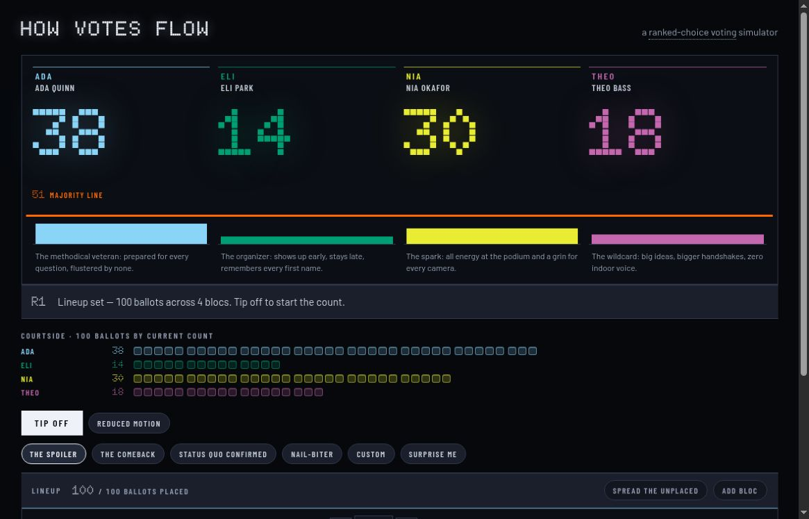
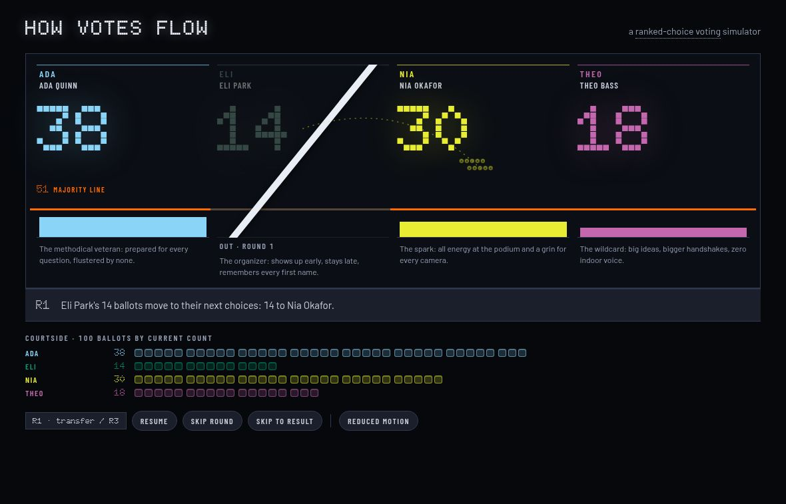
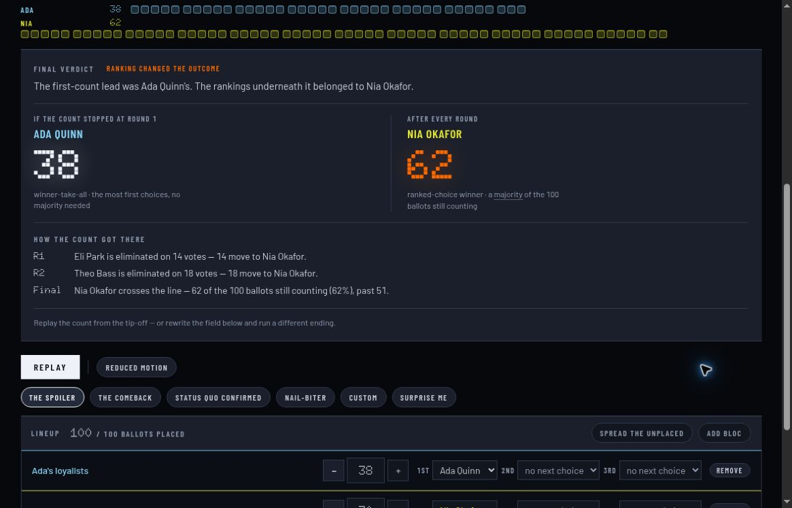

# How Votes Flow

**The first-round leader does not always win. Watch the rankings change the result.**

How Votes Flow is an interactive, one-page explanation of single-winner ranked-choice voting. Arrange 100 fictional ballots, start the count, and watch eliminated candidates’ votes move to the next available choices. The final verdict compares the first-choice leader with the eventual winner and explains each transfer.

[Try the simulator](https://vote.graydonwasil.com/) · [See a result change](#from-38-first-choices-to-a-different-winner) · [Build a scenario](#change-the-ballots) · [Run locally](#run-locally)



*Actual app capture. Candidates, ballot groups, and election totals are authored fictional examples.*

## From 38 first choices to a different winner

Choose **The Spoiler**, then press **Tip off**. Ada leads the first-choice count with 38 votes, but no candidate has the 51 votes needed for a majority of all 100 active ballots.

| Step | What happens | Result |
| --- | --- | --- |
| First choices | Ada 38, Nia 30, Theo 18, Eli 14 | Ada leads; nobody has a majority |
| Eliminate Eli | His 14 ballots rank Nia next | Nia rises from 30 to 44 |
| Eliminate Theo | His 18 ballots also transfer to Nia | Nia reaches 62 |
| Final verdict | Nia 62, Ada 38 | The rankings change the winner |



*The transfer is still in flight in this capture; Nia’s displayed tally has not yet reached 44.*

This is the central experiment: the first-choice-only view favors Ada, while counting the same voters’ later preferences produces a Nia victory. Rankings supply the information that the first-round tally alone cannot show.



## Change the ballots

The editor works with **1–12 voter blocs**, representing people who share a ranking. Each bloc has a weight and up to three choices among four fictional candidates: Ada Quinn, Eli Park, Nia Okafor, and Theo Bass.

| Control | What it does |
| --- | --- |
| Bloc vote count and + / − controls | Change how many ballots share a ranking |
| First, second, and third choices | Set that group’s candidate preferences |
| **Add bloc** / **Remove** | Expand or simplify the ballot groups |
| **Spread the unplaced** | Redistribute ballots left unassigned after edits |
| **Tip off** | Start counting once all 100 ballots are placed |
| Preset buttons | Load one of four authored demonstrations |
| **Custom** | Start four 25-ballot blocs, one per candidate, with first choices only |
| **Surprise me** | Generate a randomized scenario to explore |

Reducing or removing a bloc returns its ballots to the unplaced pool. The count cannot start until the full 100 are assigned. Editing after a verdict resets playback so the next count uses the changed ballots.

Scenarios live in the current page session. There is no scenario-save account, public sharing workflow, or real-election importer.

## Follow the count at your pace

Use **Pause / Resume** to hold a moment, **Skip round** to move ahead, **Skip to result** to jump to the verdict, or **Replay** to watch again. **Reduced motion** offers a less animated presentation. There is no playback-speed selector.

The board combines four views of the same count:

- **Active candidate tallies** show current totals; eliminated lanes retain their last pre-elimination totals.
- **Proportional bars and majority line** show how close each remaining candidate is to winning.
- **Transfer motion and narration** explain where an eliminated candidate’s ballots go.
- **Courtside tokens** account for all 100 ballots during the count, including those no longer counting. During editing, the placed/unplaced counter tracks the unassigned remainder.

The verdict names both the first-round leader and final winner, then lists the elimination path. You can use it to discuss either a changed result or a confirmed initial lead.

## Four different lessons

| Preset | What to watch |
| --- | --- |
| **The Spoiler** | Ada leads initially; Nia collects both eliminated groups and wins 62–38 |
| **The Comeback** | Eli begins third with 24, reaches 41 after Theo’s elimination, then wins with 68 |
| **Status Quo Confirmed** | Theo starts at 45 and reaches 52 when Ada’s votes split between Theo and Eli |
| **Nail-Biter** | A disclosed tie-break and exhausted ballots change the remaining field and majority threshold |

These are demonstrations of different possible outcomes, not claims about which outcome is typical in real elections.

## What “no longer counting” means

A ballot counts for its highest-ranked candidate still in contention. If every candidate listed on it has been eliminated, the ballot is **exhausted**: it remains visible in the accounting row but no longer contributes to the active total.

The simulator sets the majority threshold to **half the active ballots, rounded down, plus one**. That line can therefore fall below 51.

In the fictional **Nail-Biter** example, 15 ballots eventually exhaust. Of the 85 still counting, Ada finishes with 44 and Eli with 41. The majority line is 43, so Ada wins without needing 51 of the original 100 ballots.

### Counting rules and ties

- This is **single-winner instant-runoff voting**, not a multi-seat proportional election.
- With more than two candidates remaining and no majority, the lowest remaining candidate is eliminated and ballots move to their next available ranked choice.
- For an elimination tie, this implementation removes the tied candidate with fewer first-round votes. If still tied, earlier cast order loses.
- With two candidates remaining and no majority, the engine uses the same first-round-votes/cast-order tie-break and declares the survivor the winner. Under its active-ballot denominator, this covers an exact tie.

Tie procedures vary between jurisdictions. These are the simulator’s documented rules, not a universal election rulebook. See the [counting engine](src/engine/count.ts) and [rule definitions](src/engine/rules.ts) for the exact implementation.

## Stack and architecture

| Layer | Implementation | Purpose |
| --- | --- | --- |
| Interface | React and TypeScript | Ballot editor, board, playback controls, and verdict |
| Counting | Pure TypeScript engine | Turn ranked ballot groups into deterministic round results |
| Playback | Timeline and state machine | Present those results through pauses, transfers, skips, and replay |
| Styling | Tailwind CSS and authored styles | Dark arena board, candidate colors, proportional bars, and emphasis |
| Typography | Bundled Fontsource fonts | Doto score digits and Barlow interface text |
| Build and checks | Vite, TypeScript, Vitest | Local development, static output, and logic/contract tests |

The data path is straightforward: **scenario/editor → counting engine → round results → playback → board and verdict**. Counting is separate from the animation, so playback presents the result rather than deciding it.

Transfers follow custom curved paths, with moving groups of up to five tokens. The app does not depend on a charting or Sankey library. It is client-only, with no application backend, accounts, or analytics integration.

## Run locally

Use a current **Node 22 release, at least 22.12.0**, matching the major version in `.node-version`. The package’s minimum declaration is lower, but the full locked toolchain includes Puppeteer dependencies that require 22.12.0 or newer.

```sh
git clone https://github.com/Arrangedgodly/how-votes-flow.git
cd how-votes-flow
npm install
npm run dev
```

| Command | Purpose |
| --- | --- |
| `npm run dev` | Start the Vite development server |
| `npm test` | Run the Vitest suite |
| `npm run build` | Type-check with `tsc -b`, then build to `dist/` |
| `npm run preview` | Serve the production build locally |

The suite covers the counting engine, scenario outcomes, editor invariants, playback, narration, board state, theme, and static accessibility contracts. Its accessibility assertions are not a replacement for a full browser/screen-reader audit. No new test-pass count is claimed here.

## Hosting and project notes

The production output is a static `dist/` directory. The project’s documented deployment uses Cloudflare Pages with `npm run build` as the build command; the live simulator is at [vote.graydonwasil.com](https://vote.graydonwasil.com/).

- [PRODUCT.md](PRODUCT.md): audience, goals, and constraints
- [DESIGN.md](DESIGN.md): Arena Board visual language
- [Scenario recipes](src/scenarios/recipes.ts): authored ballot groups
- [Scenario tests](src/scenarios/scenarios.test.ts): expected transfer paths and winners

## License

[MIT](LICENSE).
