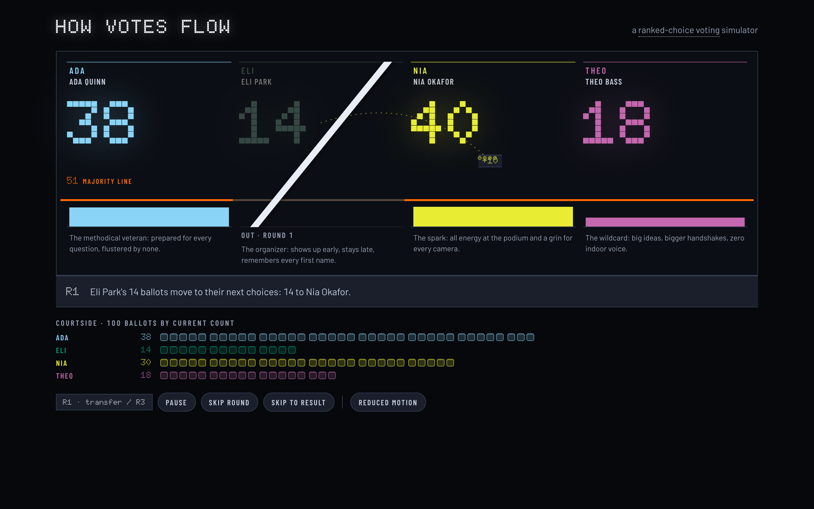

# How Votes Flow

A one-page simulator that shows how ranked-choice voting works — by letting you watch it happen.

**Live: <https://vote.graydonwasil.com>**



Allocate 100 votes across four fictional candidates, then tip off the count. Round 1 is framed the way winner-take-all would call it; each elimination round sends the lowest candidate's votes streaming to their voters' next choices — with the running count pinned to every transfer — until someone crosses the majority line. The verdict card names the winner under both systems, and whether ranked-choice changed the result.

Built for civic-curious adults, students, and classroom demos. The cast is fictional and party-neutral; the counting follows real single-winner instant-runoff practice (majority of votes still counting; leader wins if the final two remain; deterministic tie-break, disclosed on screen — real jurisdictions often draw lots instead).

## Run it locally

```bash
npm install
npm run dev      # local dev server
npm test         # counting engine, scenarios, playback, board, accessibility
npm run build    # production build to dist/
npm run preview  # serve the production build
```

Requires Node 20.19+ (pinned via `.node-version`).

## Scenarios

Four authored presets, a blank custom slate, and a Surprise Me randomizer — every number editable on the board itself:

- **The Spoiler** — ranked-choice flips the winner-take-all result
- **The Comeback** — an early trailer consolidates and wins
- **Status Quo Confirmed** — ranked-choice agrees with the plurality leader
- **Nail-Biter** — a disclosed elimination tie and exhausted ballots

## Deployment

Client-only static build — any static host works. Currently live on Cloudflare Pages (connected to this repository, build `npm run build` → `dist/`) at [vote.graydonwasil.com](https://vote.graydonwasil.com).

## Project records

- `PRODUCT.md` — product truth: users, constraints, principles
- `DESIGN.md` — the built design system (Arena Board world)
- `docs/ultron/` — scoping brief, plan, research record, production log

No analytics, no backend, no accounts — the app runs entirely in the browser.

## License

[MIT](LICENSE)
